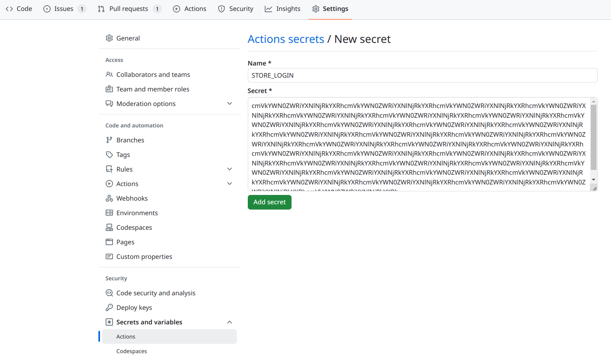

<p align="center">
  <a href="https://github.com/snapcore/action-publish/actions"></a>
</p>

# Snapcraft Publish Action

This is a Github Action that can be used to publish [snap
packages](https://snapcraft.io) to the Snap Store.  In most cases, it
will be used with the `snapcraft-build-action` action to build the
package.  The following workflow should be sufficient for Snapcraft 7 or later:

```yaml
jobs:
  build:
    runs-on: ubuntu-latest
    steps:
    - uses: actions/checkout@v4
    - uses: snapcore/action-build@v1
      id: build
    - uses: snapcore/action-publish@v1
      env:
        SNAPCRAFT_STORE_CREDENTIALS: ${{ secrets.STORE_LOGIN }}
      with:
        snap: ${{ steps.build.outputs.snap }}
        release: edge
```

Alternatively, on Snapcraft 6 and older:
```yaml
jobs:
  build:
    runs-on: ubuntu-latest
    steps:
    - uses: actions/checkout@v4
    - uses: snapcore/action-build@v1
      id: build
    - uses: snapcore/action-publish@v1
      with:
        store_login: ${{ secrets.STORE_LOGIN }}
        snap: ${{ steps.build.outputs.snap }}
        release: edge
```

This will build the project, upload the result to the store, and
release it to the `edge` channel.  If the `release` input parameter is
omitted, then the build will not be uploaded but not released.


## Store Login

In order to upload to the store, the action requires login
credentials.  Rather than a user name and password, the action expects
the data produced by the `snapcraft export-login` command.

As well as preventing the exposure of the password, it also allows the
credentials to be locked down to only the access the action requires:

```sh
$ snapcraft export-login --snaps=PACKAGE_NAME \
      --acls package_access,package_push,package_update,package_release \
      exported.txt
```

This will produce a file `exported.txt` containing the login data.
The credentials can be restricted further with the `--channels` and
`--expires` arguments if desired.

In order to make the credentials available to the workflow, they
should be stored as a repository secret:

1. Select the "Settings" tab.
2. Select "Secrets and variables > Actions"  from the menu on the left.
3. Click "New repository secret".
4. Set the name to `STORE_LOGIN` (or whatever is referenced in the workflow), and paste the contents of `exported.txt` as the value.



Note that while this secret may be named arbitrarily,
the secret must be passed to the action in the `env` as `SNAPCRAFT_STORE_CREDENTIALS`.
See [snapcraft authentication options docs](https://snapcraft.io/docs/snapcraft-authentication#snapcraft_store_credentials-environment-variable) for more information.

```yaml
- uses: snapcore/action-publish@v1
  env:
    SNAPCRAFT_STORE_CREDENTIALS: ${{ secrets.STORE_LOGIN }}
```
